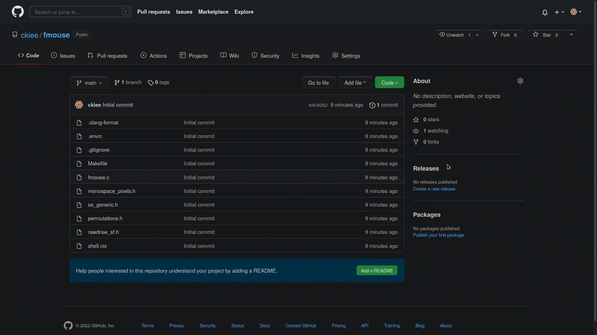

# fmouse

fmouse lets you tell your mouse to fuck off! Instead of reaching over for your mouse, just mash a few keys.



## Building

- Get these dependencies `libglvnd xorg.libXinerama xorg.libXext xorg.libX11 xorg.libXtst xorg.libXi`
- `make all`
- Copy the `fmouse` binary somewhere

## License

```txt
    fmouse
    Copyright (C) 2022  ckiee

    This program is free software: you can redistribute it and/or modify
    it under the terms of the GNU General Public License as published by
    the Free Software Foundation, either version 3 of the License, or
    (at your option) any later version.

    This program is distributed in the hope that it will be useful,
    but WITHOUT ANY WARRANTY; without even the implied warranty of
    MERCHANTABILITY or FITNESS FOR A PARTICULAR PURPOSE.  See the
    GNU General Public License for more details.

    You should have received a copy of the GNU General Public License
    along with this program.  If not, see <https://www.gnu.org/licenses/>.
```

